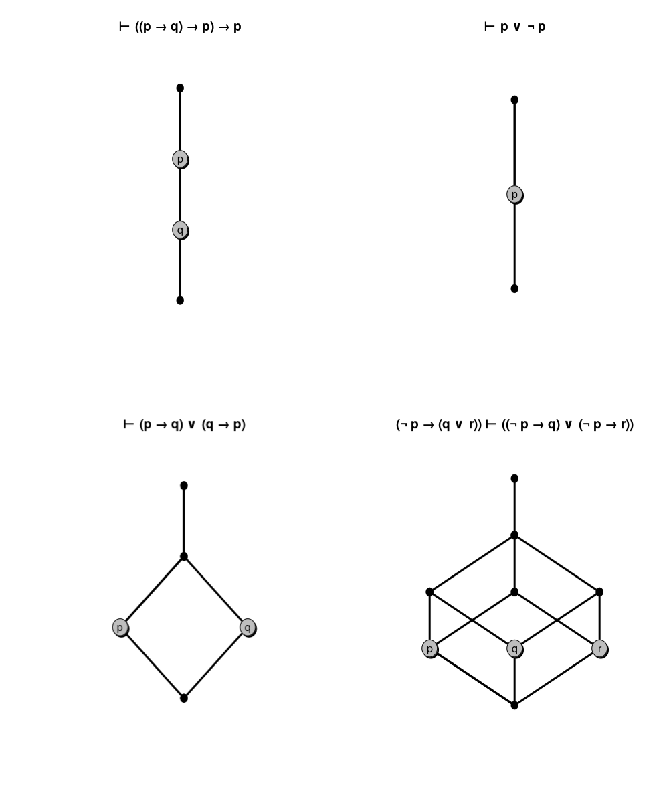

# HeytinGET

Find an intuitionistic counter-model for a proposition.

## Some of its central features:
- Topological semantics.
- Kernel build upon GNU/Bison.

## Heyting poset

Let $`\mathfrak{H} = (P, \leq)`$ be partially ordered set with a minimal element. If, for every $`x,y \in P`$, the following properties holds

```math
max \space \{ z : z \leq x \space and \space z \leq y \} \space \equiv \space (x \land y) \\
max \space \{ z : x \leq z \space and \space y \leq z \} \space \equiv \space (x \lor y) \\
max \space \{ z : x \land z \leq y \}  \space \equiv \space (x \rightarrow y) \\
```

then we say that $`\mathfrak{H}`$ is a Heyting poset (named after the logician Arend Heyting).

As is widely known, every Heyting poset is a topology. So, let $`T = (X, \tau)`$ be a topology, then we can re-define these operators in terms of their topological counterparts 

```math
O_x \cap O_y \space \equiv \space (x \land y) \\
O_x \cup O_y \space \equiv \space (x \lor y) \\
O_{(X - O_x)} \cup O_y  \space \equiv \space (x \rightarrow y) \\
```

without any loss of generality.

### Logical justification

We for granted that

```math
\Gamma \vdash_i \varphi \Rightarrow T \models \varphi
```

and then

```math
T \nvDash \varphi \Rightarrow \Gamma \not\vdash \varphi 
```

so if a model T do not models a proposition \varphi, then this proposition is not intuistionistically provable.

### The HeytinGET way

Every input (a given proposition) is translated into a semantically equivalent expression of pertinency in open sets of an arbitrary topology $`T`$.

```shell
for topo in $(cat topos.t)
do
	sed "s/%EXPR/$expr/g" is_cm.py > eval.py
	sed -i -e "s/%TOPOLOGY/$topo/g" eval.py 
	python eval.py $n_prop
done
```

The idea is to look at every topology pre-seted on [topology file](topos.t) file with every possible valuation.

## Examples

<div align="center">



</div>

## Usage

```console
user@host:~$ zsh h_cmodel.sh "proposition"
```
