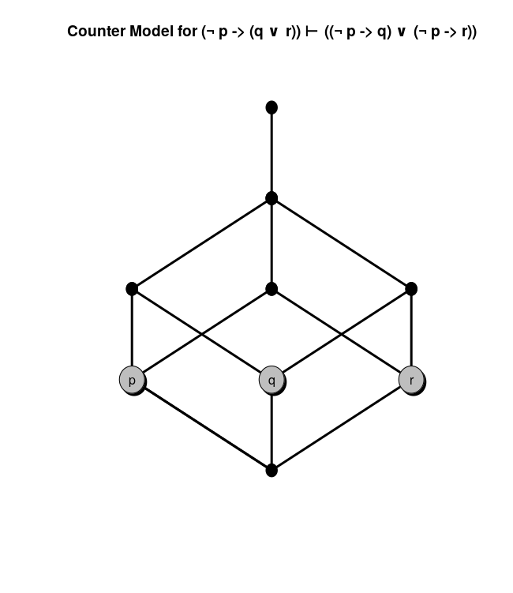

# HeytinGET

Find a counter-model and a valuation for the corresponding heyting poset for a proposition.

## Some of its central features:
- Topological semantics.
- Kernel build upon GNU/Bison.

## Heyting poset

If a partially ordered set $`(P, \leq)`$ have the following properties

```math
max \space \{ z : z \leq x \space and \space z \leq y \} \space (x \land y) \\
max \space \{ z : x \leq z \space and \space y \leq z \} \space (x \lor y) \\
max \space \{ z : x \land z \leq y \}  \space (x \rightarrow y) \\
```

then we say that it is a Heyting poset (named after the famous mathematician Arend Heyting).

## Example


