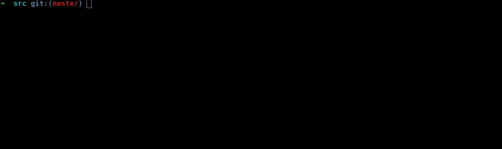

# HeytinGET


[](https://www.gnu.org/licenses/gpl-3.0)
[](https://pypi.python.org/pypi/ansicolortags/)

> Find intuitionistic counter-models for classical tautologies.

## Table of contents

[[_TOC_]]

## Some of its central features

- Topological semantics.
- Kernel build upon GNU/Bison.
- Open-source.
- Command-line based.

## Algorithm

**HeytinGET** is a tool for logicians designed to optimize the task of searching for mathematical models. In what follows we expose the algorithm main lines, as well an informal proof of its correctness.

### Logical justification

#### Boolean-valued model

Using a Boolean-valued model $`(B, +, *, \bot, \top)`$, we can define the notion of tautology in the following way. 

Let $`v: Prop \rightarrow B`$ be a function that assign to every proposition of the language **Prop** a value of a boolean model **B**. Then we will say that $`\varphi`$ is a tautology if, and only if, for every valuation $`v`$, $`v(\varphi) = \top`$. We will denote this as $`\models_B \varphi`$.

#### Topological Heyting poset

We can extend our notion of Boolean-valued model.

Let $`\mathfrak{H} = (P, \leq)`$ be partially ordered set with a minimal element. If, for every pair $`x,y \in P`$, there is

```math
max \space \{ z : z \leq x \space and \space z \leq y \} \space \equiv \space (x \land y) \\
max \space \{ z : x \leq z \space and \space y \leq z \} \space \equiv \space (x \lor y) \\
max \space \{ z : x \land z \leq y \}  \space \equiv \space (x \rightarrow y) \\
```

then we say that $`\mathfrak{H}`$ is a Heyting poset (named after the logician Arend Heyting).

As is widely known, every Heyting poset is a topology. So, let $`T = (X, \tau)`$ be a topology, then we can re-define these operators in terms of their topological counterparts 

```math
O_x \cap O_y \space \equiv \space (x \land y) \\
O_x \cup O_y \space \equiv \space (x \lor y) \\
O_{(X - O_x)} \cup O_y  \space \equiv \space (x \rightarrow y) \\
```

without any loss of generality.

A proposition $`\varphi`$ is a **classical tautology** if it is a *tautology* (in the sense of a tautology in a Boolean valued-model) in a topology T on which $`O_x \cup (X - O_x) = X`$ for every open set $`O_x`$. We will denote this as $`\models_T \varphi`$.

For example, $`p \lor \neg p`$ is a classical tautology because it is a tautology in any discrete topology $`\tau = (X, P(X))`$ given by the power-set of a set *X*.

**(Definition)** A *topological intuitionistic model* is a tuple $`(T, \leq, v)`$, where $`\leq`$ is a preorder on $`T`$ and $`v : Prop \rightarrow T`$ is a function that assigns, to each propositional variable, a open set of the topology $`T`$.

#### Intuitionistic counter-model 

We take for granted (via Deduction Theorem) that, given a set $`\Gamma = \{ \varphi_0, \varphi_1, \varphi_2, ..., \varphi_n \}`$ of propositions, we have

```math
\Gamma \vdash_i \varphi \space \Rightarrow \space \vdash_i \bigwedge\limits_{i=0}^n \{ \Gamma \} \rightarrow \varphi
```

Let $`\psi \equiv \bigwedge\limits_{i=0}^n \{ \Gamma \} \rightarrow \varphi `$. So, via soundness of $`\vdash_i`$,

```math
\vdash_i \psi \Rightarrow \models_T \psi
```

and then

```math
\nvDash_T \psi \Rightarrow \neg (\vdash_i \psi)
```

so if exists a topology $`T`$ that do not models a proposition $`\psi`$, then this proposition is not intuitionistically provable.

### The HeytinGET way

Every input (a given proposition) is translated into a semantically equivalent expression of pertinency in open sets of an arbitrary topology $`T`$.

```shell
for topo in $(cat topos.t)
do
	sed "s/%EXPR/$expr/g" is_cm.py > eval.py
	sed -i -e "s/%TOPOLOGY/$topo/g" eval.py 
	python eval.py $n_prop
done
```

The idea is to look at every topology pre-seted on [topos.t](src/topos.t) file with every possible valuation.

### Correctness

We can easily see that this algorithm is correct in the following sense: 

If there is a valuation for a given counter-model in [topos.t](src/topos.t) in which the proposition do not hold, then the program will output this model with that valuation, once we have that our loop is over every line of the file. So, if the proposition is not intuistionistically provable in any model of the universe of our topologies database, then we can guarantee that the program will indicate us that.

## Examples

<div align="center">


</div>

## Usage

```console
user@host:~$ cd src/
user@host:~$ zsh h_cmodel.sh "proposition"
```

<div align="center">

</div>

Notice that the program shows **every** counter-models found. 

# Future work

In future versions, I plan to implement more features, such like:

- Graphical interface;
- Graphical output;
- Command-line options;

# Contact

For comments, suggestions, bug report: please contact me via <rntreisleme@gmail.com>.

